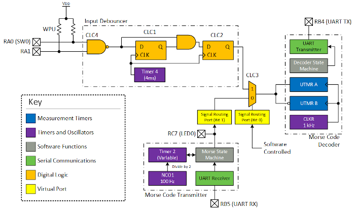
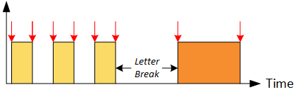
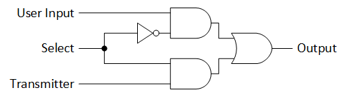
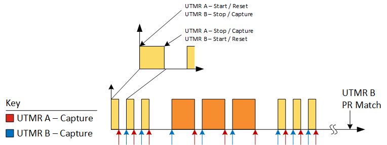
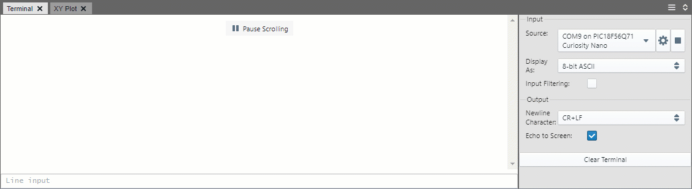
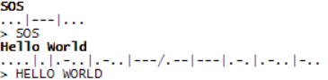

<!-- Please do not change this logo with link -->

# Morse Code Transmitter and Receiver with PIC18F56Q71

Using the on-chip Core Independent Peripherals (CIPs), the PIC18F56Q71 microcontroller can transmit Morse code (via an LED) or receive/decode Morse code (by printing to serial terminal). To implement this functionality, the Universial Timer (UTMR), Signal Routing Port, Configurable Logic Cell (CLC), Clock Reference (CLKREF), Numerically Controlled Oscillator (NCO), UART, and Timer 2 CIPs are used. 

## Related Software

- [Switch Debouncing with the PIC18F16Q40](https://github.com/microchip-pic-avr-examples/pic18f16q40-clc-switch-debouncing)

## Software Used

- [MPLAB® X IDE v6.0.5 or newer](https://www.microchip.com/en-us/tools-resources/develop/mplab-x-ide?utm_source=GitHub&utm_medium=&utm_campaign=MCU8_MMTCha_pic18q71&utm_content=pic18f56q71-morse-code-mplab-mcc-github)
- [MPLAB XC8 Compiler v2.41.0 or newer compiler](https://www.microchip.com/en-us/tools-resources/develop/mplab-xc-compilers?utm_source=GitHub&utm_medium=&utm_campaign=MCU8_MMTCha_pic18q71&utm_content=pic18f56q71-morse-code-mplab-mcc-github)
- [MPLAB Code Configurator (MCC)](https://www.microchip.com/en-us/tools-resources/configure/mplab-code-configurator?utm_source=GitHub&utm_medium=&utm_campaign=MCU8_MMTCha_pic18q71&utm_content=pic18f56q71-morse-code-mplab-mcc-github)
- [MPLAB Data Visualizer](https://www.microchip.com/en-us/tools-resources/debug/mplab-data-visualizer?utm_source=GitHub&utm_medium=&utm_campaign=MCU8_MMTCha_pic18q71&utm_content=pic18f56q71-morse-code-mplab-mcc-github) or other serial terminal
- PIC18F-Q_DFP v1.17.379 or newer

## Hardware Used

- [PIC8F56Q71 Curiosity Nano Evaluation Kit (EV01G21A)](https://www.microchip.com/en-us/development-tool/EV01G21A?utm_source=GitHub&utm_medium=&utm_campaign=MCU8_MMTCha_pic18q71&utm_content=pic18f56q71-morse-code-mplab-mcc-github)

## Setup

This example is fully self-contained on the Curiosity Nano. However, an external button or telegraph key can be connected to RA1, for ease of use (if typing messages out manually).

### I/O Usage

| I/O Pin | Function
| ------- | --------
| RA0 | SW0 Input
| RA1 | External User Input
| RB4 | UART TX
| RB5 | UART RX
| RC7 | LED0 Output  

### UART Setup  

- Baud Rate: 9600
- Character Length: 8 bits
- Parity: None
- Stop Bits: 1 bit  

## Theory of Operation

  

This example can generate Morse code from a stream of text (A-Z, 0-9) as well as decode Morse code from a selectable input source, either the transmitter or an external input. The transmitter and receiver operate independently of each other.

In addition, the Configurable Logic Cells (CLCs) are used to implement a dual input debouncer and a digital multiplexer by using the Signal Routing Port. 

### Transmitter

Text to be transmitted is sent by UART to the microcontroller. When each character is received, the application loads it into a ring buffer. Wehn the character '\n' is received, the transmission sequence begins. 

In Morse code, dot and dash are differentiated by the length of their on time. After transmitting the dot or dash, the transmitter must remain off for a certain period of time. The length of the off time depends on whether this is a:

- In-Character Break
- Letter Break
- Word Break

For both simplicity and efficency, the state machine for the transmitter only is called when the transmitter state *could* change, as shown in the picture below, in red. Timer 2 is set up as a one-shot timer, with the period set by the state machine before starting. 

  

### Dual Input Debouncer

This demo allows users to either use the button on the Curiosity Nano (SW0) or to connect their own button or input source. To implement this functionality, both inputs are connected via a NAND (in CLC4) to make a single output for the input debouncer.

The input debouncer utilized in this example is the 2 CLC configuration discussed in [Switch Debouncing with the PIC18F16Q40](https://github.com/microchip-pic-avr-examples/pic18f16q40-clc-switch-debouncing).

### Receiver Multiplexer

For flexibility, this demo has two inputs. The default input is to connect the transmitter output to the receiver. Since the transmitter has tight timings, the receiver will always process the message correctly. The other input option is an external (debounced) input. This allows the user to decode their own entered message using the pushbutton on the Curiosity Nano or another signal source.

To implement the multiplexer in the CLC, logic equivalent to the following is used.

  

### Receiver and Decoder

#### Universial Timers (UTMR)
Universial Timers (UTMR) are used to receive and decode Morse code. The UTMRs are 16-bit timers with advanced start/stop/reset capabilities. When a rising edge occurs on the input to the UTMR, the timer starts and resets it's count. On the next edge (falling), the timer will stop and capture the current count. This generates a Capture Interrupt.

If the pulse remains HIGH for longer than the timeout period set for the UTMR, the UTMR will reset to 0, and generate a PR Match Interrupt. In the PR Match Interrupt Service Routine (ISR), the UTMR is manually stopped to prevent more interrupts from being triggered. The UTMR is re-enabled shortly after, in the state machine.

**Note: UTMR B uses inverted logic to UTMR A, but is otherwise identical.**

#### Processing Data  
Each interrupt from the UTMR is used to move the internal decoder state machine to the next state. In most cases, the sequence received would be:

1. UTMR A - Capture
2. UTMR B - Capture

In this case, the captured values from each of the UTMRs can be processed into the characters DOT / DASH / BREAK. For the positive width measurement (UTMR A), DOT and DASH are shifted into a buffer for later use, with a DOT being represented as 0 and a DASH being a 1.

For the negative width, DOT is in-character break (and is ignored), DASH indicates the end of a letter, which triggers the buffer to be decoded, and a DASH is considered a word BREAK, which decodes the buffer and then prints the word break.  

When the Morse code is complete, UTMR B will timeout and generate a PR Match interrupt, as there is no rising edge to stop the timer.

During receive, if the timeout for the positive width measurement (UTMR A) is triggered, the state machine moves to an Error state. The negative edge measurement, when it occurs, will be discarded. 

## Output and Operation

  

### Transmitting a Message
To transmit Morse code, type a message in the serial terminal, then press Enter. The message will not be sent until the microcontroller receives the '\n' character from the serial terminal. The transmitter output is LED0 on the Curiosity Nano. If the receiver is connected to the transmitter, then the output will also appear on the UART terminal.  

*Note: Only characters A-Z and 0-9 are supported.*

### Receiving and Decoding a Message
The receiver and decoder in this example has two possible inputs - an internal input, where the microcontroller decodes the same data that it transmits, or a user input, where either the pushbutton on the Curiosity Nano or an external button / telegraph key can be used to send data.

**Note: By default, the program uses internal input.**

#### UART Morse Output

  

Output Characters  
'.' - Dot  
'-' - Dash  
'|' - Letter Break  
'/' - Word Break (Default)

#### Operation (Internal Input)  
Receiving and decoding is handled automatically by transmitting a message. 

#### Operation (User Input)  
**Note: The Morse code decoder requires specific timings for proper operation. There is some error margin provided in the decoder, but it is still difficult to consistently maintain the correct timing pattern.**

To send a character, press and release the button with the following (default) timings:

- Timebase unit: 200 ms
- Dot (1 unit)
- Dash (3 units)

When the button is released, the length of the release time also plays a role in determining whether the character is complete or if there are more dots and dashes for the character being sent.

- In-Character Break (1 unit)
- Character Break (3 units)
- Word Break (7 units)

You can find a copy of the Morse code alphabet and specification [here](https://www.itu.int/rec/R-REC-M.1677-1-200910-I/en).

## Program Options

### Switch to User Input  
The receiver/decoder can be switched to manually keyed user input by uncommenting (`USER_INPUT_DECODE`) in `main.c`. 

### Print Message on Startup
If `PRINT_ON_STARTUP` in `main.c` is defined, a message such as "hello world" can be transmitted immediately on startup. The message can be changed in `main.c` as well. 

### Edit Timebase
The timebase the Morse code transmitter and decoder runs at (`MORSE_TIME_BASE`) can be adjusted in `morseCommon.h`. The valid timebase range is between 40 ms and 1400 ms. 

**Note: To ensure correct operation with internal transmitter, timebase should be a multiple of 40.**  

### Disable Letter Breaks
If `SHOW_LETTER_BREAKS` is commented out in `morseRx.h`, then letter breaks will not be shown in the Morse code output.

Output Examples:  
- With Letter Breaks: ...|---|...
- Without Letter Breaks: ...---...

### Change Word Break Character
The word break character can be changed to an arbitrary string in `morseRx.h` by editing `SPACE_CHAR_RX`. **This must be a string.** 

### Enable START Character Transmit
If `ENABLE_START_TX` is defined in `morseCommon.h`, then the START symbol is transmitted before all messages. 

## Summary
This example has shown how the CIPs in the PIC18-Q71 family can be used to generate and decode data. 