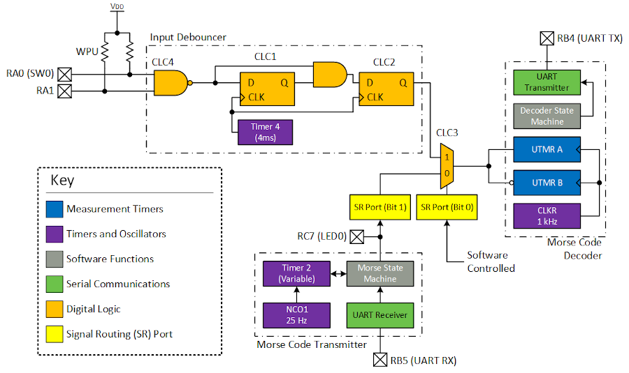

<!-- Please do not change this logo with link -->

# Morse Code Transmitter and Receiver with PIC18F56Q71

Morse code is a type of Frequency-Shift Key (FSK) communication. Using the on-chip Core Independent Peripherals (CIPs), morse code can be transmitted (via an LED) or received (by printing to serial terminal) by the microcontroller. To implement this functionality, the Universial Timer (UTMR), Signal Routing Port, Configurable Logic Cell (CLC), Clock Reference (CLKREF), Numerically Controlled Oscillator (NCO), UART, and Timer 2 CIPs are used. 

## Related Software

- [Switch Debouncing with the PIC18F16Q40](https://github.com/microchip-pic-avr-examples/pic18f16q40-clc-switch-debouncing)

## Software Used

- [MPLAB® X IDE v6.0.5 or newer](#)
- [MPLAB XC8 Compiler v2.41.0 or newer compiler](#)
- [MPLAB Code Configurator (MCC)](#)
- PIC18F-Q_DFP v1.17.379 or newer

## Hardware Used

- PIC8F56Q71 Curiosity Nano Evaluation Kit (???)

## Setup

This demo is fully self-contained on the Curiosity Nano. However, an external button or telegraph key can be connected to RA1, if desired.

### UART Setup

//To be added

## Theory of Operation

  

The demo can generate a morse code sequence from a UART stream and it can decode morse code from a selectable input source (the transmitter or an external input). The transmitter and receiver operate independently of each other.

In addition, the Configurable Logic Cells (CLCs) are used to implement a dual input debouncer and a digital multiplexer by using the Signal Routing Port. 

### Transmitter

Text to be transmitted is sent via UART to the microcontroller. When each character is received, the application loads it into a ring buffer. If the character '\n' is received, the transmission sequence begins. 

In morse code, DOT and DASH are differentiated by the length of their ON time. After transmitting the DOT or DASH, the transmitter must remain OFF for a length of time. The length of OFF time depends on whether this is a:

- In-Character Break
- Letter Break
- Word Break

For both simplicity and efficency, the state machine for the transmitter only is called when the transmitter state *could* change, as shown in the picture below, in red. Timer 2 is setup as a one-shot timer, with the period set by the state machine before starting. 

  

### Dual Input Debouncer

This demo allows users to either use the button on the Curiosity Nano (SW0) or to connect up their own button or input source. To support this operating mode, both inputs are connected via NAND (in CLC4) to make a single output for the input debouncer.

The input debouncer is the 2 CLC configuration discussed in [this example](https://github.com/microchip-pic-avr-examples/pic18f16q40-clc-switch-debouncing).

### Receiver Multiplexer

For flexibility, this demo has 2 inputs. The default input is to connect the transmitter output to the receiver. Since the transmitter has exact timings, the receiver will always process the message correctly. The other input is an external (debounced) input. This allows the user to decode their own entered message using the pushbutton the Curiosity Nano or another signal source.

To implement the multiplexer in the CLC, logic equivalant to the following is used.

  

### Receiver and Decoder

#### Universial Timers (UTMR)
To receive and decode morse code, the Universial Timers (UTMR) are used. The UTMRs are 16-bit timers with advanced start/stop/reset capabilities. When a rising edge occurs on the input to the UTMR, the timer starts and resets it's count. On the next edge (falling), the timer will stop and capture the current count. This generates a Capture Interrupt.

If the pulse remains HIGH for longer than the timeout period set for the UTMR, the UTMR will reset to 0, and generate a PR Match Interrupt. In the PR Match Interrupt Service Routine (ISR), the UTMR is manually stopped to prevent more interrupts from being triggered. The UTMR is re-enabled shortly after, in the state machine.

*Note: UTMR B uses inverted logic to UTMR A, but is otherwise identical.*

#### Processing Data  
Each interrupt from the UTMR is used to move the internal decoder state machine to the next state. In most cases, the sequence received would be:

1. UTMR A - Capture
2. UTMR B - Capture

In this case, the captured values from each of the UTMRs can be processed into DOT / DASH / BREAK in software. For the positive width measurement (UTMR A), the DOT and DASH are shifted into a buffer variable, with DOT being 0 and DASH being 1.

For the negative width, DOT is in-character break (and is ignored), DASH indicates the end of a letter, which triggers the buffer variable to be decoded, and finally a DASH is considered a word BREAK, which prints " ", "/", etc...

When the morse code is complete, UTMR B will timeout and generate a PR Match interrupt, as there is no rising edge to stop the timer.

It's possible for errors to occur in transmission. The most noteable is a timeout for the positive width measurement (UTMR A). If this occurs, the state machine moves to an error state. The negative edge measurement, when it occurs, will be discarded. 

## Transmitting a Message
To transmit Morse code, type a message in the Serial Terminal, then press Enter. The message will not be sent until the microcontroller receives the '\n' character from the serial terminal.

## Receiving and Decoding a Message
The receiver and decoder half of the program has 2 possible inputs - an internal input, where the microcontroller decodes the same data that it transmits, or a user input, where either the pushbutton on the Curiosity Nano or an (*optional*) externally connected button / telegraph key can be used to send data.

**By default, the program uses internal input.**

  

### UART Morse Output

'.' - Dot  
'-' - Dash  
'|' - Letter Break  
'/' - Word Break (Default)

### Operation (Internal Input)

Receiving and decoding is handled automatically by transmitting a message. 

### Operation (User Input)

*Note: The morse code decoder requires specific timings for proper operation. There is margin programmed in to make it easier, but it is still difficult to maintain the correct timing pattern.*

To send a character, press and release the button with the following timings:

- Timebase unit: 200ms
- Dot (1 unit)
- Dash (3 units)

When the button is released, the length of the release time also plays a role in determining whether the character is complete or if there are more dots and dashes for the character being sent.

- In-Character Break (1 unit)
- Character Break (3 units)
- Word Break (7 units)

You can find a copy of the morse Code alphabet and specification [here](https://www.itu.int/dms_pubrec/itu-r/rec/m/R-REC-M.1677-1-200910-I!!PDF-E.pdf).

## Program Options

### Modify Timebase
The timebase the morse code transmitter and decoder runs at (`MORSE_TIME_BASE`) can be adjusted in `morseCommon.h`. The valid timebase range is between 20 ms and 728 ms. 

### Disable Letter Breaks
If `SHOW_LETTER_BREAKS` is commented out in `morseRx.h`, then letter breaks will not be shown in the morse code output.

Output Examples:  
- With Letter Breaks: ...|---|...
- Without Letter Breaks: ...---...

### Change Word Break Character
The word break character can be changed to an arbitrary string in `morseRx.h` by editing `SPACE_CHAR_RX`. **This must be a string.** 

### Enable START Character Transmit
If `ENABLE_START_TX` is defined in `morseCommon.h`, then the START symbol is transmitted before all messages. 

## Summary
This example has shown how the CIPs in the PIC18-Q71 family can be used to generate and decode data. 